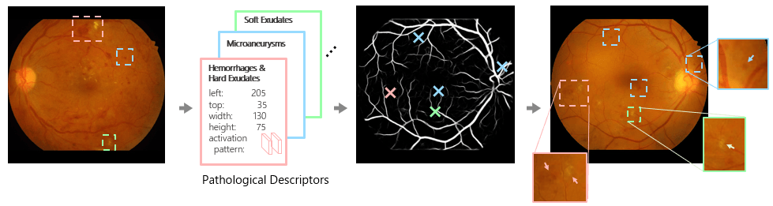
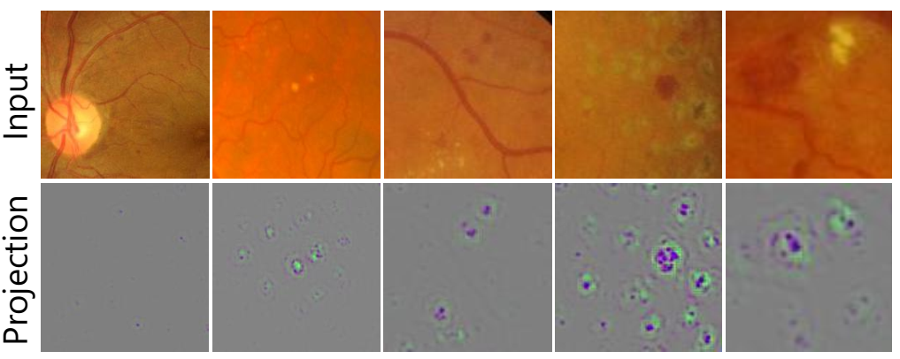
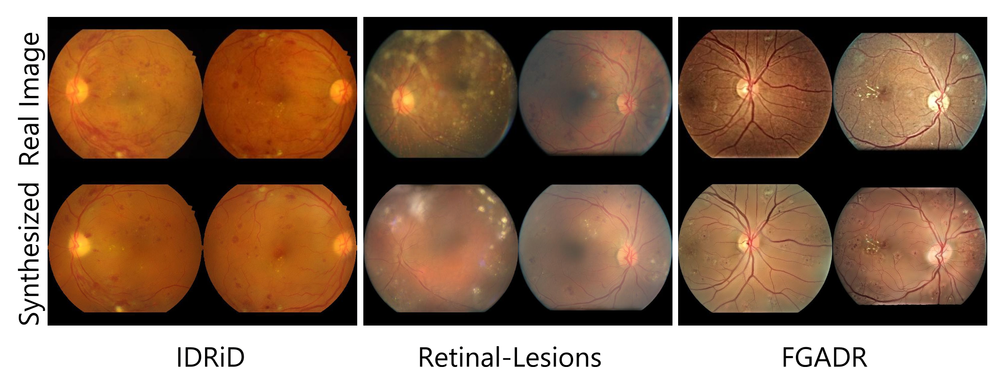
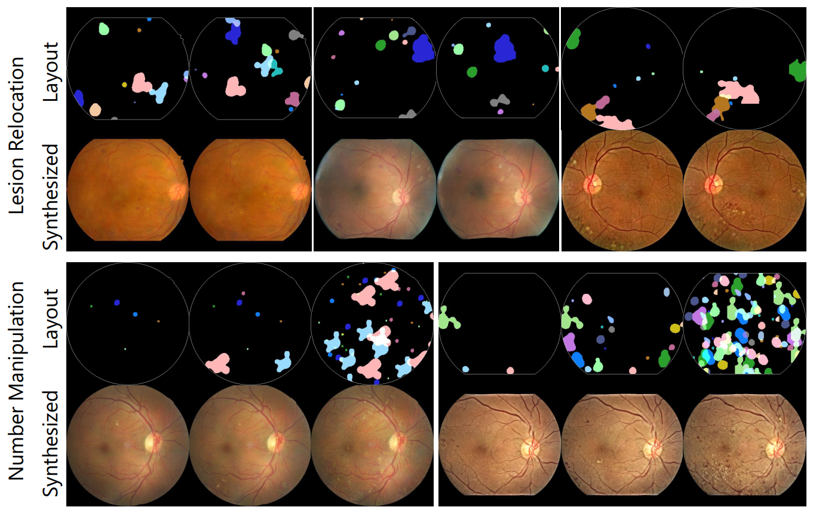

# Patho-GAN: Interpretation + Medical Data Augmentation

This repo is the project for IEEE JBHI paper "[Explainable Diabetic Retinopathy Detection and Retinal Image Generation](https://doi.org/10.1109/JBHI.2021.3110593)" ([arxiv](https://arxiv.org/abs/2107.00296)),  based on a previous AAAI'19 work "[Pathological Evidence Exploration in Deep Retinal Image Diagnosis](https://ojs.aaai.org//index.php/AAAI/article/view/3901)" ([arxiv](https://arxiv.org/abs/1812.02640)). Inspired by Koch's Postulates, the foundation in evidence-based medicine (EBM) to identify the pathogen, we propose to exploit the interpretability of deep learning application in medical diagnosis.

This is a comprehensive medical image framework featuring:

- Unsupervised lesion detection & rough segmentation
- Detecting lesions related to disease diagnosis such as microaneurysms, hemorrhages, soft and hard exudates
- Fundus image synthesis with full controllability of lesion location and number
- Data augmentation, fast and photo-realistic
- CNN Interpretability framework

With a diabetic retinopathy (DR) fundus as input, Pathological Descriptors can be extracted from [pretrained DR detectors](https://github.com/zzdyyy/kaggle_diabetic_keras). Patho-GAN can then generate diabetic retinopathy (DR) fundus given Pathological descriptors and vessel segmentation. 



**Interpretation**: We can determine the symptoms that the DR detector identifies as evidence to make prediction. This explainable work helps medical community to further understand on how deep learning makes prediction and encourage more collaboration. 



**Augmentation**: We can generate high quality medical images with various lesions, suitable for medical data augmentation (not only DR retinal fundus). The synthesized lesions is controllable by location and quantity.





# Paper

IEEE JBHI paper "[Explainable Diabetic Retinopathy Detection and Retinal Image Generation](https://doi.org/10.1109/JBHI.2021.3110593)" ([arxiv](https://arxiv.org/abs/2107.00296))

AAAI'19 work "[Pathological Evidence Exploration in Deep Retinal Image Diagnosis](https://ojs.aaai.org//index.php/AAAI/article/view/3901)" ([arxiv](https://arxiv.org/abs/1812.02640))

Please consider citing us. 

```
@article{niu2021explainable,
  author={Niu, Yuhao and Gu, Lin and Zhao, Yitian and Lu, Feng},
  journal={IEEE Journal of Biomedical and Health Informatics}, 
  title={Explainable Diabetic Retinopathy Detection and Retinal Image Generation}, 
  year={2021},
  doi={10.1109/JBHI.2021.3110593}
}
```

# Requirements

The code is tested under Ubuntu16.04+Python3.5+Tensorflow1.8+Keras2.2. You can install a python3.5 environment and run: 

```bash
pip install --upgrade pip
pip install -r requirements.txt 
```

Alternatively, you can find a docker image at https://hub.docker.com/r/zzdyyy/patho-gan on Linux machine with GPU(s).


# Testing

To synthesize DR images with pre-trained model:

```bash
# Download pretrained VGG-19 model
wget -O data/imagenet-vgg-verydeep-19.mat 'http://www.vlfeat.org/matconvnet/models/beta16/imagenet-vgg-verydeep-19.mat'

# Download pretrained o_O detector model
gdown -O data/detector.h5 'https://drive.google.com/uc?id=1OI1d3XWM7IyW2igIEq8s-ZyF9vw0vTiw'

# Download IDRiD vessel segmentation, descriptors, and pretrained Patho-GAN model
gdown -O idrid_testing.tar.xz 'https://drive.google.com/uc?id=1Cf1WoaoGf6m7t6z70kpEl1SXOxTeM6Qu'
tar -xvf idrid_testing.tar.xz

# Run test script, and generated `Test/IDRiD_Reconstruct` directory
python Test_reconstruct_DMB.py IDRiD
```

To generate activation maps:

```bash
# this will output the activation maps in Visualization/IDRiD_test/
python tfpipe_dump_activation.py data/IDRiD/test_512/*.jpg --dump_to IDRiD_test --visualize
```

# Training

We take IDRiD dataset for example.

1. Download dataset from [this link](https://ieee-dataport.org/open-access/indian-diabetic-retinopathy-image-dataset-idrid), and extract it.
2. To crop and resize images into 512x512, cd into `data/IDRiD`, and run following line :
    ```
    python convert.py --directory '/path_to_extracted_data/IDRiD/A. Segmentation/1. Original Images/a. Training Set' --convert_directory train_512/
    python convert.py --directory '/path_to_extracted_data/IDRiD/A. Segmentation/1. Original Images/b. Testing Set' --convert_directory test_512/
    ```
3. Generate vessel segmentation. Clone modified version of [SA-UNet](https://github.com/zzdyyy/SA-UNet), and run in its root directory:
    ```
    python Test_PathoGAN.py IDRiD
    ```
4. Generate the numpy of the dataset. Run `python to_npy.py` in `data/IDRiD/`.
5. Generate descriptors for test samples. Download data/imagenet-vgg-verydeep-19.mat, run in Patho-GAN's root directory:
    ```
    python DMB_build_test_samples.py IDRiD IDRiD_55.jpg IDRiD_61.jpg IDRiD_73.jpg IDRiD_81.jpg
    python DMB_build_test_samples.py retinal-lesions 250_right.jpg 2016_right.jpg 2044_left.jpg 2767_left.jpg
    python DMB_build_test_samples.py FGADR 0508.jpg 0549.jpg 0515.jpg 0529.jpg
    ```
6. Start training:
    ```
    python Train.py IDRiD IDRiD_55.jpg IDRiD_61.jpg IDRiD_73.jpg IDRiD_81.jpg
    python Train.py retinal-lesions 250_right.jpg 2016_right.jpg 2044_left.jpg 2767_left.jpg
    python Train.py FGADR 0508.jpg 0549.jpg 0515.jpg 0529.jpg
    ```
